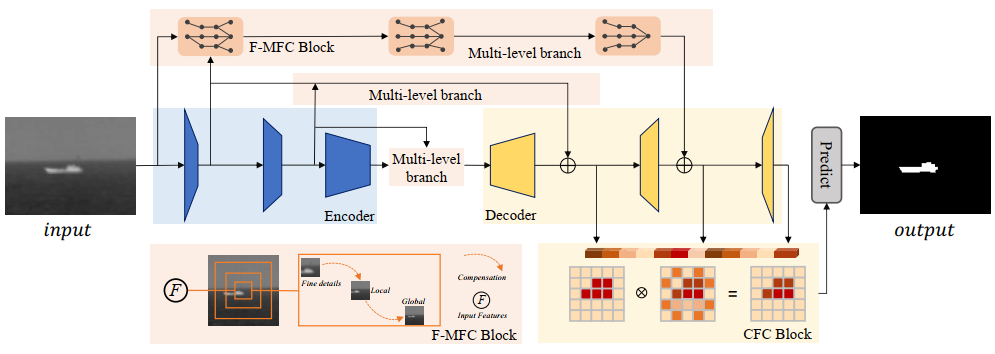
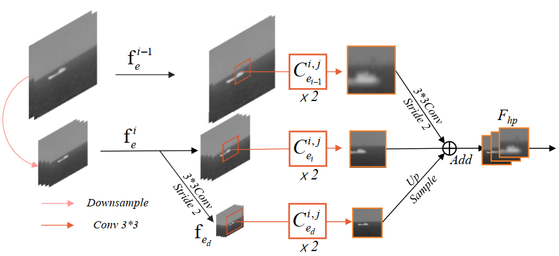
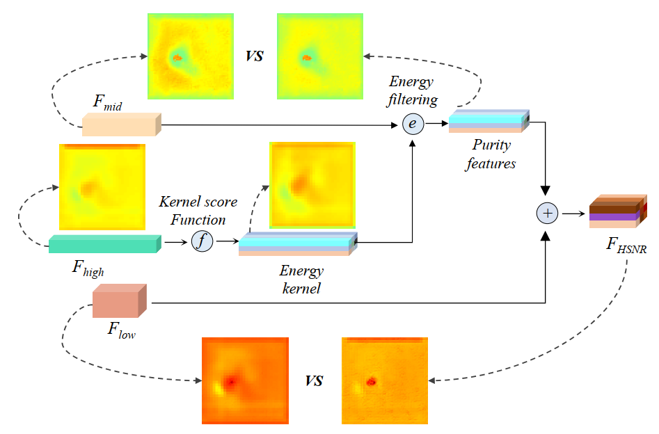

<h1 align="center">Exploring Feature Compensation and Cross-level Correlation for Infrared Small Target Detection [ACM MM 2022]</h1>

<h4 align="center">This is the official repository of the paper ''Exploring Feature Compensation and Cross-level Correlation for Infrared Small Target Detection''</a>.</h4>

<h5 align="center"><em>Mingjing Zhang, Ke Yue&#8727;, Jing Zhang, Yunsong Li&#8727;, and Xinbo Gao</em></h5>

[//]: # (
)

[//]: # (  <a href="#introduction">Introduction</a> |)

[//]: # (  <a href="#ppt-setting-and-p3m-10k-dataset">PPT and P3M-10k</a> |)

[//]: # (  <a href="#p3m-net">P3M-Net</a> |)

[//]: # (  <a href="#benchmark">Benchmark</a> |)

[//]: # (  <a href="#results">Results</a> |)

[//]: # (  <a href="https://github.com/JizhiziLi/P3M/tree/master/core">Train and Test</a> |)

[//]: # (  <a href="##inference-code---how-to-test-on-your-images">Inference code</a> |)

[//]: # (  <a href="#statement">Statement</a>)

[//]: # (
)

[//]: # ()

[//]: # (> [2021-12-06]: Publish the face mask of the training set and P3M-500-P validation set of [<strong>P3M-10k</strong>]&#40;#ppt-setting-and-p3m-10k-dataset&#41; dataset.)
> 
> | Dataset | 
Dataset Link (Google Drive)
 | 
Dataset Link (Baidu Wangpan 百度网盘)
 |       Dataset Release Agreement              |
>| :----:| :----: |:----------------------------------------------------------------------------------------------------------------------:| :----: | 
>|IRSTD-1k|[Link](https://drive.google.com/file/d/1JoGDGF96v4CncKZprDnoIor0k1opaLZa/view?usp=sharing)|[Link](https://caiyun.139.com/m/i?0K5CIsRSEZZiU) (pw: VZtn)|                                               [Agreement (MIT License)]                                                |

[//]: # (>|P3M-10k facemask &#40;optional&#41;|[Link]&#40;https://drive.google.com/file/d/1I-71PbkWcivBv3ly60V0zvtYRd3ddyYs/view?usp=sharing&#41;|[Link]&#40;https://pan.baidu.com/s/1D9Kj_OIJbFTsqWfbMPzh_g&#41; &#40;pw: f772&#41;|[Agreement &#40;MIT License&#41;]&#40;https://jizhizili.github.io/files/p3m_dataset_agreement/P3M-10k_Dataset_Release_Agreement.pdf&#41;| )
>

[//]: # (> [2021-11-20]: Publish the <a href="#inference-code---how-to-test-on-your-images">inference code</a> and the pretrained model &#40;[Google Drive]&#40;https://drive.google.com/uc?export=download&id=1smX2YQGIpzKbfwDYHAwete00a_YMwoG1&#41; | [Baidu Wangpan &#40;pw: 2308&#41;]&#40;https://pan.baidu.com/s/1zGF3qnnD8qpI-Z5Nz0TDGA&#41;&#41; that can be used to test on your own privacy-preserving or normal portrait images. Some test results on P3M-10k can be viewed from this [demo page]&#40;https://github.com/JizhiziLi/P3M/tree/master/demo&#41;.)

# Training
python demo.py

# Overall structure
</img>
# F-MFC
</img>
# CFC
</img>
# Cite.
Zhang, M., Yue, K., Zhang, J., Li, Y., & Gao, X. (2022, October). Exploring Feature Compensation and Cross-level Correlation for Infrared Small Target Detection. In Proceedings of the 30th ACM International Conference on Multimedia (pp. 1857-1865).
